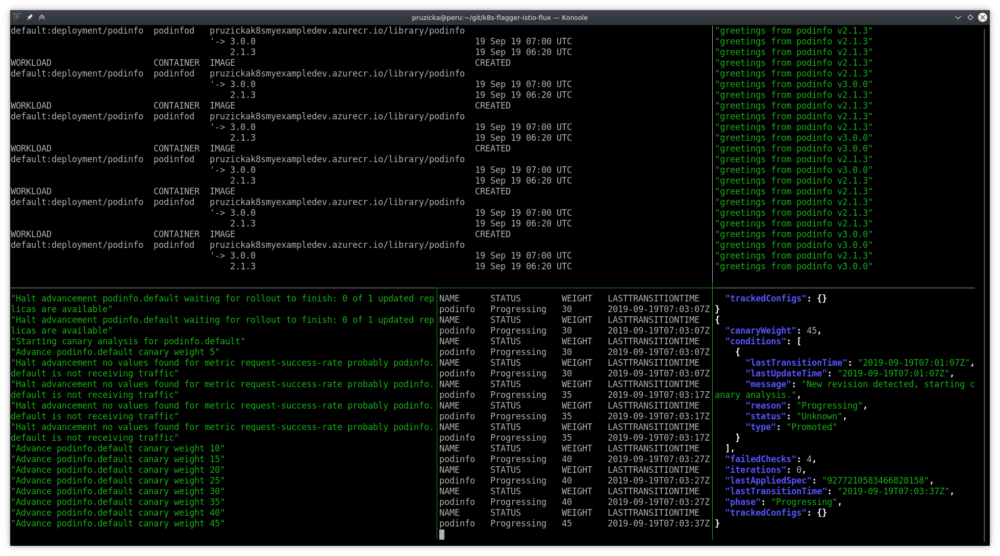
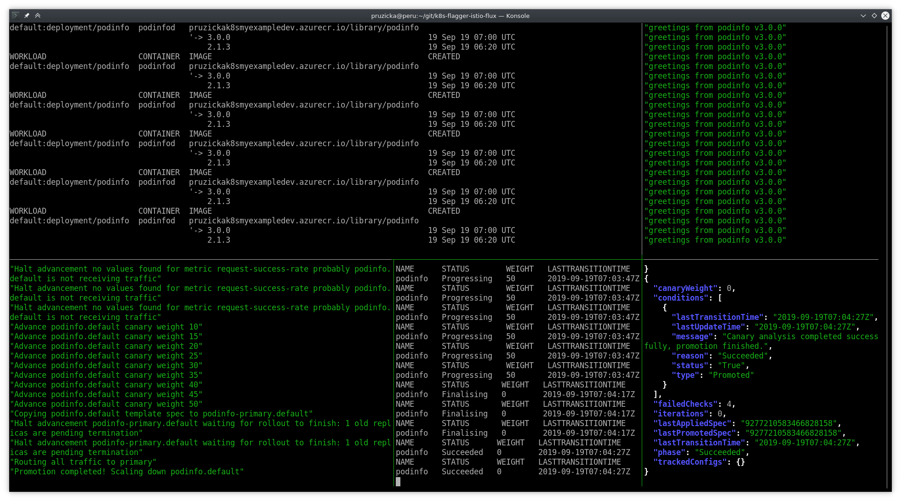
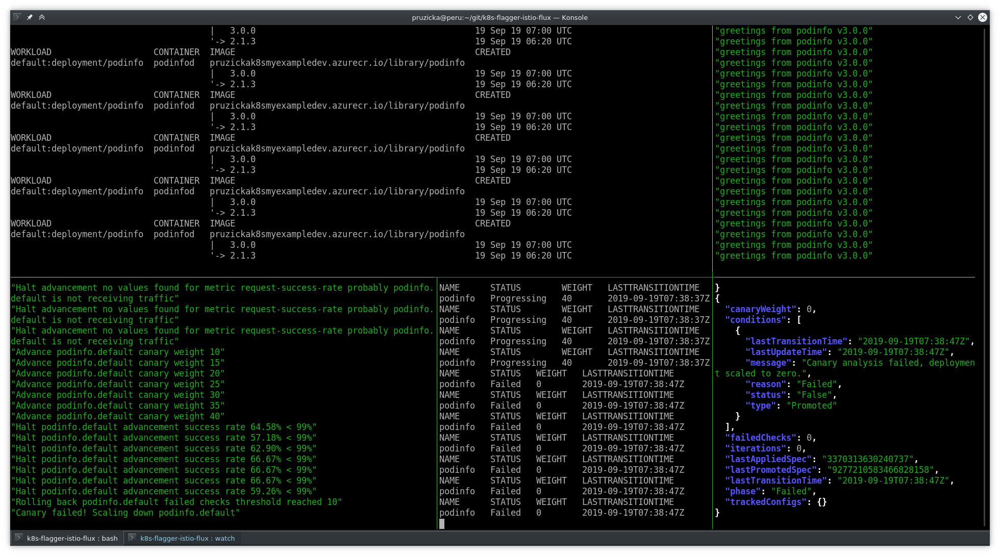

# Blue / Green deployment

Label the `default` namespace with `istio-injection=enabled`:

```bash
kubectl label namespace default istio-injection=enabled
```

Output:

```text
namespace/default labeled
```

Prepare the application manifest and save it to Git repository:

```bash
cat << EOF > tmp/k8s-flux-repository/workloads/podinfo.yaml
---
apiVersion: apps/v1
kind: Deployment
metadata:
  name: podinfo
  namespace: default
  labels:
    app: podinfo
  annotations:
    flux.weave.works/automated: "true"
spec:
  minReadySeconds: 5
  revisionHistoryLimit: 5
  progressDeadlineSeconds: 60
  strategy:
    rollingUpdate:
      maxUnavailable: 0
    type: RollingUpdate
  selector:
    matchLabels:
      app: podinfo
  template:
    metadata:
      annotations:
        prometheus.io/scrape: "true"
      labels:
        app: podinfo
    spec:
      imagePullSecrets:
      - name: docker-config
      containers:
      - name: podinfod
        image: pruzickak8smyexampledev.azurecr.io/library/podinfo:2.1.3
        ports:
        - containerPort: 9898
          name: http
          protocol: TCP
        command:
        - ./podinfo
        - --port=9898
        - --level=info
        - --random-delay=false
        - --random-error=false
        env:
        - name: PODINFO_UI_COLOR
          value: green
        livenessProbe:
          exec:
            command:
            - podcli
            - check
            - http
            - localhost:9898/healthz
          initialDelaySeconds: 5
          timeoutSeconds: 5
        readinessProbe:
          exec:
            command:
            - podcli
            - check
            - http
            - localhost:9898/readyz
          initialDelaySeconds: 5
          timeoutSeconds: 5
        resources:
          limits:
            cpu: 2000m
            memory: 512Mi
          requests:
            cpu: 100m
            memory: 64Mi
---
apiVersion: networking.istio.io/v1alpha3
kind: Gateway
metadata:
  name: podinfo-gateway
  namespace: default
spec:
  selector:
    istio: ingressgateway
  servers:
  - port:
      number: 80
      name: http-podinfo
      protocol: HTTP
    hosts:
    - podinfo.${MY_DOMAIN}
  - port:
      number: 443
      name: https-podinfo
      protocol: HTTPS
    hosts:
    - podinfo.${MY_DOMAIN}
    tls:
      credentialName: ingress-cert-${LETSENCRYPT_ENVIRONMENT}
      mode: SIMPLE
      privateKey: sds
      serverCertificate: sds
---
apiVersion: flagger.app/v1alpha3
kind: Canary
metadata:
  name: podinfo
  namespace: default
spec:
  # service mesh provider (default istio)
  # can be: kubernetes, istio, appmesh, smi, nginx, gloo, supergloo
  # use the kubernetes provider for Blue/Green style deployments
  provider: istio
  # deployment reference
  targetRef:
    apiVersion: apps/v1
    kind: Deployment
    name: podinfo
  # the maximum time in seconds for the canary deployment
  # to make progress before it is rollback (default 600s)
  progressDeadlineSeconds: 60
  service:
    # container port
    port: 9898
    # port name can be http or grpc (default http)
    portName: http
    # add all the other container ports
    # when generating ClusterIP services (default false)
    portDiscovery: false
    # Istio gateways (optional)
    gateways:
    - podinfo-gateway
      # remove the mesh gateway if the public host is
      # shared across multiple virtual services
    # - mesh
    # Istio virtual service host names (optional)
    hosts:
    - podinfo.${MY_DOMAIN}
  # define the canary analysis timing and KPIs
  canaryAnalysis:
    # schedule interval (default 60s)
    interval: 10s
    # max number of failed metric checks before rollback
    threshold: 10
    # max traffic percentage routed to canary
    # percentage (0-100)
    maxWeight: 50
    # canary increment step
    # percentage (0-100)
    stepWeight: 5
    # Prometheus checks
    metrics:
    - name: request-success-rate
      # minimum req success rate (non 5xx responses)
      # percentage (0-100)
      threshold: 99
      interval: 1m
    - name: request-duration
      # maximum req duration P99
      # milliseconds
      threshold: 500
      interval: 30s
EOF
```

Push the manifest file into the git repository:

```bash
git -C tmp/k8s-flux-repository add --verbose .
git -C tmp/k8s-flux-repository commit -m "Add podinfo application"
git -C tmp/k8s-flux-repository push -q
fluxctl sync
```

Output:

```text
add 'workloads/podinfo.yaml'
[master 22f3a9c] Add podinfo application
 1 file changed, 98 insertions(+)
 create mode 100644 workloads/podinfo.yaml
Synchronizing with git@github.com:ruzickap/k8s-flux-repository
Revision of master to apply is 22f3a9c
Waiting for 22f3a9c to be applied ...
Done.
```

If you open the [http://podinfo.myexample.dev](http://podinfo.myexample.dev) you
should see the following application:


The application should be ready. Verify the canary deployment details:

```bash
kubectl describe canaries.flagger.app podinfo
```

Output:

```text
Name:         podinfo
Namespace:    default
Labels:       fluxcd.io/sync-gc-mark=sha256.suFcgXeCzNfy8IJ1JhXT7MbBGtOihk5WMiPqxL3zuOY
Annotations:  fluxcd.io/sync-checksum: 82d7e7352c7d652cb326d2510831c2d82d1c48f6
              kubectl.kubernetes.io/last-applied-configuration:
                {"apiVersion":"flagger.app/v1alpha3","kind":"Canary","metadata":{"annotations":{"fluxcd.io/sync-checksum":"82d7e7352c7d652cb326d2510831c2d...
API Version:  flagger.app/v1alpha3
Kind:         Canary
Metadata:
  Creation Timestamp:  2019-09-19T06:32:30Z
  Generation:          1
  Resource Version:    7504
  Self Link:           /apis/flagger.app/v1alpha3/namespaces/default/canaries/podinfo
  UID:                 41ae5dd2-daa7-11e9-b8e0-e21b22ce44b3
Spec:
  Canary Analysis:
    Interval:    10s
    Max Weight:  50
    Metrics:
      Interval:               1m
      Name:                   request-success-rate
      Threshold:              99
      Interval:               30s
      Name:                   request-duration
      Threshold:              500
    Step Weight:              5
    Threshold:                10
  Progress Deadline Seconds:  60
  Provider:                   istio
  Service:
    Gateways:
      podinfo-gateway
    Hosts:
      podinfo.myexample.dev
    Port:            9898
    Port Discovery:  false
    Port Name:       http
  Target Ref:
    API Version:  apps/v1
    Kind:         Deployment
    Name:         podinfo
Status:
  Canary Weight:  0
  Conditions:
    Last Transition Time:  2019-09-19T06:33:07Z
    Last Update Time:      2019-09-19T06:33:07Z
    Message:               Deployment initialization completed.
    Reason:                Initialized
    Status:                True
    Type:                  Promoted
  Failed Checks:           0
  Iterations:              0
  Last Applied Spec:       3370313630240737
  Last Transition Time:    2019-09-19T06:33:07Z
  Phase:                   Initialized
  Tracked Configs:
Events:
  Type     Reason  Age                From     Message
  ----     ------  ----               ----     -------
  Warning  Synced  40s (x3 over 59s)  flagger  Halt advancement podinfo-primary.default waiting for rollout to finish: 0 of 1 updated replicas are available
  Normal   Synced  30s                flagger  Initialization done! podinfo.default
```

The original deployment `podinfo` doesn't have any pods now and new deployment
`podinfo-primary` was created by Flagger which takes care about the traffic:

```bash
kubectl get deployment
```

Output:

```text
NAME              READY   UP-TO-DATE   AVAILABLE   AGE
podinfo           0/0     0            0           7m3s
podinfo-primary   1/1     1            1           117s
```

There are three new services created
by Flagger - `podinfo-canary` and `podinfo-primary`:

```bash
kubectl get services
```

Output:

```text
NAME              TYPE        CLUSTER-IP     EXTERNAL-IP   PORT(S)    AGE
kubernetes        ClusterIP   10.0.0.1       <none>        443/TCP    43m
podinfo           ClusterIP   10.0.4.160     <none>        9898/TCP   3m38s
podinfo-canary    ClusterIP   10.0.179.151   <none>        9898/TCP   3m38s
podinfo-primary   ClusterIP   10.0.29.128    <none>        9898/TCP   3m38s
```

There is also new `VirtualService`:

```bash
kubectl describe virtualservices.networking.istio.io podinfo
```

Output:

```text
Name:         podinfo
Namespace:    default
Labels:       <none>
Annotations:  <none>
API Version:  networking.istio.io/v1alpha3
Kind:         VirtualService
Metadata:
  Creation Timestamp:  2019-09-19T06:32:38Z
  Generation:          1
  Owner References:
    API Version:           flagger.app/v1alpha3
    Block Owner Deletion:  true
    Controller:            true
    Kind:                  Canary
    Name:                  podinfo
    UID:                   41ae5dd2-daa7-11e9-b8e0-e21b22ce44b3
  Resource Version:        7403
  Self Link:               /apis/networking.istio.io/v1alpha3/namespaces/default/virtualservices/podinfo
  UID:                     4621815f-daa7-11e9-b8e0-e21b22ce44b3
Spec:
  Gateways:
    podinfo-gateway
  Hosts:
    podinfo.myexample.dev
    podinfo
  Http:
    Route:
      Destination:
        Host:  podinfo-primary
      Weight:  100
      Destination:
        Host:  podinfo-canary
      Weight:  0
Events:        <none>
```

You can also see two new `DestinationRules`:

```bash
kubectl describe destinationrules.networking.istio.io
```

Output:

```text
Name:         podinfo-canary
Namespace:    default
Labels:       <none>
Annotations:  <none>
API Version:  networking.istio.io/v1alpha3
Kind:         DestinationRule
Metadata:
  Creation Timestamp:  2019-09-19T06:32:37Z
  Generation:          1
  Owner References:
    API Version:           flagger.app/v1alpha3
    Block Owner Deletion:  true
    Controller:            true
    Kind:                  Canary
    Name:                  podinfo
    UID:                   41ae5dd2-daa7-11e9-b8e0-e21b22ce44b3
  Resource Version:        7400
  Self Link:               /apis/networking.istio.io/v1alpha3/namespaces/default/destinationrules/podinfo-canary
  UID:                     45ed89ac-daa7-11e9-b8e0-e21b22ce44b3
Spec:
  Host:  podinfo-canary
Events:  <none>


Name:         podinfo-primary
Namespace:    default
Labels:       <none>
Annotations:  <none>
API Version:  networking.istio.io/v1alpha3
Kind:         DestinationRule
Metadata:
  Creation Timestamp:  2019-09-19T06:32:38Z
  Generation:          1
  Owner References:
    API Version:           flagger.app/v1alpha3
    Block Owner Deletion:  true
    Controller:            true
    Kind:                  Canary
    Name:                  podinfo
    UID:                   41ae5dd2-daa7-11e9-b8e0-e21b22ce44b3
  Resource Version:        7401
  Self Link:               /apis/networking.istio.io/v1alpha3/namespaces/default/destinationrules/podinfo-primary
  UID:                     460d1352-daa7-11e9-b8e0-e21b22ce44b3
Spec:
  Host:  podinfo-primary
Events:  <none>
```

Configure Tekton pipelines to build new version of `podinfo` application:

```bash
sed -i "s/2.1.3/3.0.0/" tmp/k8s-flux-repository/workloads/tekton-pipelineresource.yaml
git -C tmp/k8s-flux-repository diff
git -C tmp/k8s-flux-repository add --verbose .
git -C tmp/k8s-flux-repository commit -m "Increase podinfo application version and build container image"
git -C tmp/k8s-flux-repository push -q
fluxctl sync
```

Start building new image:

```bash
sed -i "s/name: podinfo-build-docker-image-from-git-pipelinerun/name: podinfo-build-docker-image-from-git-pipelinerun-2/" tmp/k8s-flux-repository/workloads/tekton-pipelinerun.yaml
git -C tmp/k8s-flux-repository diff
git -C tmp/k8s-flux-repository add --verbose .
git -C tmp/k8s-flux-repository commit -m "Build new image and upload it to ACR"
git -C tmp/k8s-flux-repository push -q
fluxctl sync
```

You can see the details about the pipeline here: [https://tekton-dashboard.myexample.dev/#/pipelineruns](https://tekton-dashboard.myexample.dev/#/pipelineruns)


When the build completes the new version of the `podinfo` container image will
appear in ACR:


## Canary deployment

In few minutes the new image will be stored in ACR and Flux will automatically
deploy the new image (version `3.0.0`) into Kubernetes Deployment. The change
made by Flux into the "deployment" will be registered by Flagger and then the
canary deployment will start.

Open pages in browser:

```bash
if [ -x /usr/bin/chromium-browser ]; then
  chromium-browser \
    "http://flagger-grafana.${MY_DOMAIN}/d/flagger-istio/istio-canary?orgId=1&refresh=5s&var-namespace=default&var-primary=podinfo-primary&var-canary=podinfo" \
    "http://grafana.${MY_DOMAIN}/d/UbsSZTDik/istio-workload-dashboard?orgId=1&refresh=5s&var-namespace=default&var-workload=podinfo-primary&var-srcns=All&var-srcwl=All&var-dstsvc=All" \
    &
fi
```

Run few commands in `tmux`:

```bash
tmux new-session \; \
send-keys "\
  while true ; do
  fluxctl list-images --workload default:deployment/podinfo ;
  sleep 5 ;
  done
" C-m \; \
split-window -h -p 27 \; \
send-keys "while true; do curl -s http://podinfo.${MY_DOMAIN} | jq .message; sleep 2; done" C-m \; \
split-window -v -p 50 \; \
send-keys "while true; do kubectl get canary/podinfo -o json | jq .status; sleep 1; done" C-m \; \
select-pane -t 0 \; \
split-window -v -p 50 \; \
send-keys "kubectl -n istio-system logs deployment/flagger -f | jq .msg" C-m \; \
split-window -h -p 39 \; \
send-keys "while true ; do kubectl get canaries; sleep 3; done" C-m \; \
set-option status off
```

Flux discovered new version of the container image in ACR and changed
the deployment to use it. You should see the following on the console:


Canary deployment in progress:



Grafana showing the progress of canary deployment:


Canary deployment successfully finished:



Grafana graphs when canary deployment finished:


## Failed Canary deployment

```bash
fluxctl deautomate --workload default:deployment/podinfo
fluxctl release --workload=default:deployment/podinfo --update-image=pruzickak8smyexampledev.azurecr.io/library/podinfo:2.1.3
```

Run the `tmux` commands again:

```bash
tmux new-session \; \
send-keys "\
  while true ; do
  fluxctl list-images --workload default:deployment/podinfo ;
  sleep 5 ;
  done
" C-m \; \
split-window -h -p 27 \; \
send-keys "while true; do curl -s http://podinfo.${MY_DOMAIN} | jq .message; sleep 2; done" C-m \; \
split-window -v -p 50 \; \
send-keys "while true; do kubectl get canary/podinfo -o json | jq .status; sleep 1; done" C-m \; \
select-pane -t 0 \; \
split-window -v -p 50 \; \
send-keys "kubectl -n istio-system logs deployment/flagger -f | jq .msg" C-m \; \
split-window -h -p 39 \; \
send-keys "while true ; do kubectl get canaries; sleep 3; done" C-m \; \
set-option status off
```

Generate few HTTP 500 errors during the `podinfo` migration to new version.
The migration to new version should be stopped.

```shell
watch curl -s http://podinfo.${MY_DOMAIN}/status/500
```

You can see that the Flagger registered the errors (generated by curl above):


Failing canary deployment on Grafana dashboard:


Canary deployment failed:



Grafana dashboard after canary deployment failure:


